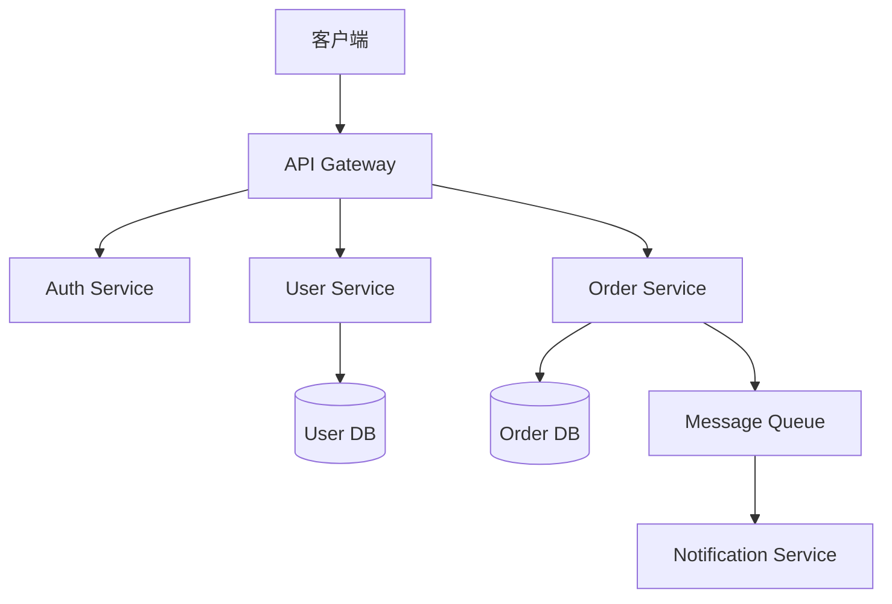

# 使用示例

## 通用识图 — image-vision

**场景 1：OCR 读取截图中的文字**

```bash
linger-image image-vision ./invoice.png "提取所有文字"
```

**场景 2：识别图表数据**

```bash
linger-image image-vision ./chart.png "这个柱状图的具体数值是多少"
```

**场景 3：快速定位报错**

```bash
linger-image image-vision ./error-screenshot.png "这个报错是什么意思"
```

**场景 4：识别图片 URL**

```bash
linger-image image-vision "https://example.com/diagram.png"
```

---

## UI/UX 界面分析 — ui-ux-vision

**场景 1：提取设计 token**

```bash
linger-image ui-ux-vision ./landing-page.png
```

输出示例：

```markdown
## 布局与层级
- 12 列栅格系统
- 间距节奏：8/16/24/32/64px
- Z-index：header(100) > modal(1000) > toast(2000)

## 组件识别
- 导航：顶部固定导航栏，logo + 5 个链接 + CTA 按钮
- Hero：全宽背景图 + 标题 + 副标题 + 双按钮
- 卡片：3x4 栅格，圆角 12px，hover 时 shadow 提升

## 设计系统
```css
--color-bg-base: #0F131C;
--color-bg-elevated: #1E2636;
--color-text-primary: #E5E7EB;
--color-accent: #38BDF8;
--font-family-base: 'Inter', sans-serif;
--font-size-body: 16px;
--border-radius: 12px;
--shadow-card: 0 4px 12px rgba(0,0,0,0.1);
```
```

**场景 2：重点分析导航栏**

```bash
linger-image ui-ux-vision ./app-screenshot.png "重点看导航的交互状态和响应式适配"
```

**场景 3：可访问性检查**

```bash
linger-image ui-ux-vision ./form.png "检查这个表单的可访问性问题"
```

---

## UI 素材设计提示词生成 — ui-material-design

**场景 1：生成图标素材提示词**

```bash
linger-image ui-material-design ./icon-ref.png "生成一套深色系的应用图标"
```

输出示例：

```markdown
## 核心提示词
app icon, glassmorphism style, dark mode, gradient from deep purple to cyan, 3D depth, soft glow effect, rounded square shape, minimal, futuristic, glass texture, neon accent

## 参数建议
- 模型：Midjourney v6
- 比例：`--ar 1:1`
- 风格化：`--stylize 100`
- 质量：`--quality 2`

## 变体 1：暖色调
app icon, glassmorphism style, dark mode, gradient from amber to orange-red, 3D depth, warm glow, rounded square, minimal, glass texture --ar 1:1 --stylize 100

## 变体 2：扁平简约
app icon, flat design, dark background, single color cyan accent, geometric shapes, minimal, modern, vector style --ar 1:1 --stylize 50

## 变体 3：3D 立体
app icon, 3D isometric, dark mode, glossy metallic material, gradient lighting, floating elements, futuristic, high detail --ar 1:1 --quality 2
```

**场景 2：生成插画素材提示词**

```bash
linger-image ui-material-design ./hero-ref.jpg "要一套配套的空状态插画"
```

**场景 3：生成背景纹理提示词**

```bash
linger-image ui-material-design ./bg-ref.png "生成网格渐变背景"
```

---

## 技术图表分析 — diagram-vision

**场景 1：架构图转 Mermaid**

```bash
linger-image diagram-vision ./architecture.png
```

输出示例：

```markdown
## 图表类型
系统架构图（微服务架构）

## Mermaid 代码


## 技术栈推断
- API Gateway: Kong / Nginx
- Message Queue: Kafka / RabbitMQ
- 数据库: PostgreSQL / MySQL
- 服务通信: REST API / gRPC
```

**场景 2：流程图转 Mermaid**

```bash
linger-image diagram-vision ./flow.png "重点关注条件分支"
```

**场景 3：ER 图转 Mermaid**

```bash
linger-image diagram-vision ./er-diagram.png
```

---

## 报错截图诊断 — error-diagnosis

**场景 1：快速诊断编译错误**

```bash
linger-image error-diagnosis ./ts-error.png
```

输出示例：

```markdown
## 错误摘要
- 错误类型：TypeScript 编译错误
- 错误码：TS2339
- 触发位置：`src/utils/helper.ts:42:15`

## 根因分析
**直接原因**：属性 `data` 不存在于类型 `Response` 上，试图访问未定义的属性。

**深层原因**：
1. `fetch` 返回的 `Response` 对象需要先调用 `.json()` 解析
2. 缺少类型守卫，未检查响应体的实际结构
3. 可能混淆了 `Response` 对象和解析后的 JSON 对象

**相关上下文**：TypeScript 4.9+，strict mode 开启

## 修复方案

### 1. 立即修复
```typescript
// 修复前
const result = response.data;

// 修复后
const json = await response.json();
const result = json.data;
```

### 2. 类型安全版本
```typescript
interface ApiResponse {
  data: unknown;
  error?: string;
}

const response = await fetch('/api/endpoint');
const json = await response.json() as ApiResponse;

if (json.error) {
  throw new Error(json.error);
}

const result = json.data;
```

### 3. 预防措施
- 添加类型定义文件 `types/api.d.ts`
- 启用 ESLint 规则：`@typescript-eslint/no-unsafe-member-access`
- 单元测试覆盖 API 响应格式

## 相关资源
- [MDN: Response.json()](https://developer.mozilla.org/en-US/docs/Web/API/Response/json)
- Stack Overflow 关键词: "typescript TS2339 response data"
```

**场景 2：诊断运行时错误**

```bash
linger-image error-diagnosis ./runtime-error.png
```

**场景 3：诊断网络错误**

```bash
linger-image error-diagnosis ./network-error.png "重点看状态码和请求头"
```

---

## 高级用法

### 指定渠道

```bash
linger-image image-vision ./img.png --channel openai
```

### JSON 输出（供程序消费）

```bash
linger-image image-vision ./img.png --json | jq '.content'
```

### 安静模式（不打印渠道调试信息）

```bash
linger-image image-vision ./img.png --quiet
```

### 禁用故障转移（单渠道失败即退出）

```bash
linger-image image-vision ./img.png --no-failover
```

### 多图一次传入

```bash
linger-image image-vision ./before.png ./after.png "对比这两张图的差异"
```

---

## 配合 Agent 使用

### Claude Code 中调用

```markdown
用户发了一张界面截图，帮我分析它的设计系统
```

Claude Code 自动识别并调用：

```bash
npx linger-image-plugin ui-ux-vision ./screenshot.png
```

### Cursor 中调用

在 `.cursor/rules/linger-image-vision.md` 生效后，直接说：

```
这张图里的报错是什么
```

Cursor 自动调用 `error-diagnosis` 技能。

### 命令行管道用法

```bash
# 批量识图
find ./screenshots -name "*.png" | xargs -I {} linger-image image-vision {}

# 提取所有 OCR 文字到文件
linger-image image-vision ./doc.png "只输出文字，不要描述" > output.txt
```

---

## 常见问题

### Q: 图片太大导致请求失败？
A: 默认限制 10MB（base64 后更大）。用图片 URL 代替本地路径，或先压缩。

### Q: 模型返回空内容？
A: 检查 `model` 字段是否是 vision 型号（如 `qwen-vl-max` 而非 `qwen-max`）。

### Q: 想要更详细的输出？
A: 在问题里明确要求："详细描述每个组件的状态和交互"。

### Q: 支持批量处理吗？
A: 支持多图一次传入，或用 shell 脚本循环调用。

### Q: 能识别视频帧吗？
A: 先用 `ffmpeg` 提取关键帧，再传给插件。

---

更多示例见各技能的 `SKILL.md` 文档。
